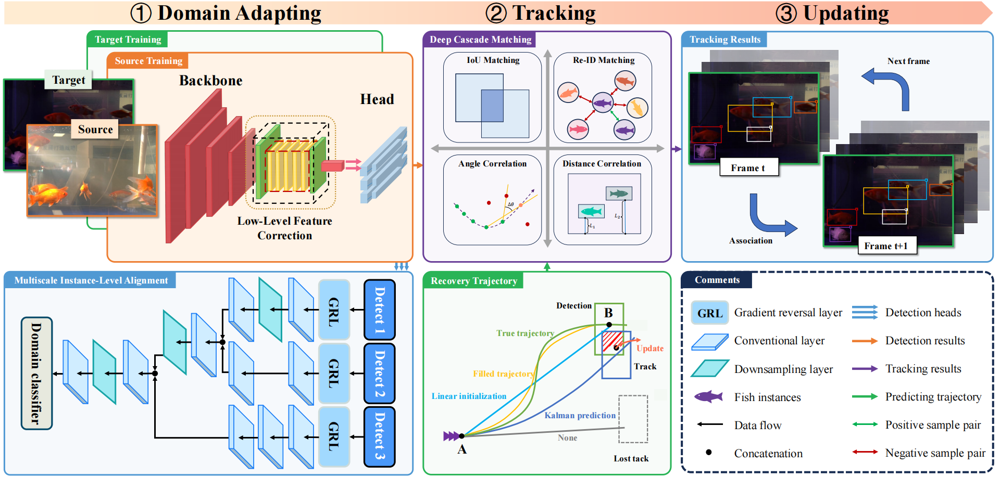
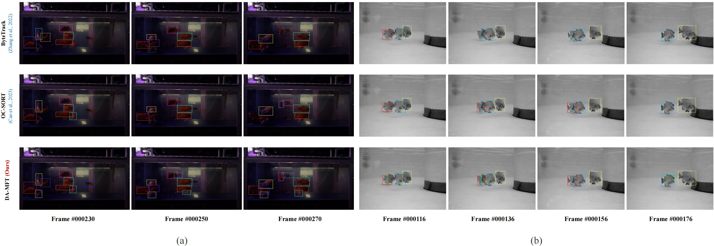
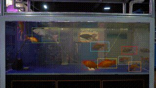
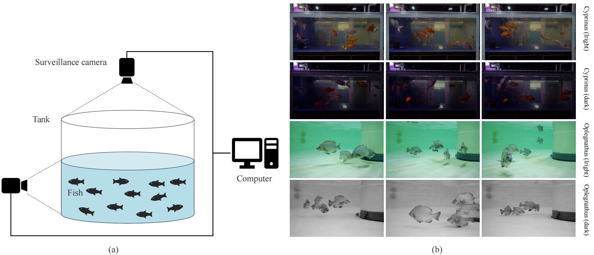

## DA-MFT: Unsupervised Multiple Fish Tracking Framework Based On Domain Adaptation
The official implementation of the paper：
>  [**DA-MFT: Unsupervised Multiple Fish Tracking Framework Based On Domain Adaptation**](##TODO:LINK##)  
>  
>  [**\[Paper\]**](##TODO:LINK##) [**\[Code\]**](https://github.com/vranlee/P2PMFT/)

-----

## Updates
+ [2024.12.04] We have initialized the repo. The related resources will be released after the manuscript is accepted.
-----

## Tracking Result Samples

   

## Tracking Video

   

## Abstract
Multiple fish tracking (MFT) is an essential computer vision task underpinning fish behavior analysis, particularly within intelligent monitoring systems for smart aquaculture. However, the data distributions obtained from captured video can be highly disparate due to variations in fish species and background complexity. Existing fish tracking methods often involve the suboptimal transfer of pre-trained models, while domain adaptation techniques often neglect the value of low-level features and multi-scale instance-level representations. To address these limitations, this paper proposes an unsupervised Domain Adaptation framework for Multiple Fish Tracking (DA-MFT). Firstly, a domain style correction is employed to enhance feature learning on unlabeled target domain data. This block integrates low-level feature fusion, facilitating target domain-style contextual learning. Then, a novel multiscale cross-head alignment block is introduced to capture domain-invariant features of fish at the instance-level. Furthermore, the framework leverages a deep cascade matching strategy to achieve self-contained fish tracking. To comprehensively evaluate performance across diverse application scenarios, a domain-adapted MFT dataset was constructed. Experimental results demonstrate that DA-MFT outperforms existing state-of-the-art (SOTA) methods, achieving the highest MOTA (86.6%) and HOTA (66.5%) scores.

## Contributions
+ An unsupervised domain adaptation framework for multiple fish tracking is presented, termed DA-MFT, especially for across scenarios in smart aquaculture.
+ Low-level feature correction and multiscale instance-level alignment are designed to facilitate domain invariant features learning in unlabeled target domain.
+ A deep cascade matching method is proposed to fully utilize the detection frames through unsupervised learning, which implements stable fish tracking by stage dividing.
+ A novel fish tracking dataset is built for domain adaptation-based multiple fish tracking, captured across diverse aquaculture condition settings and fish species.

## Data acquisition device

### Domain-adapted MFT dataset
The dataset have been released on [[BaiduYun: c5i7]](https://pan.baidu.com/s/1ZEnay9fw2EVpmAikYluWXg?pwd=c5i7). The datasets are structured as below.

~~~
├── DA-MFT
│   ├── FishMOT
│           └── train
│           └── test
│           └── annotations
│   ├── FishMOT_DA
│           └── train
│           └── test
│           └── annotations
│   ├── XU
│           └── train
│           └── test
│           └── annotations
│   ├── XU_DA
│           └── train
│           └── test
│           └── annotations
~~~

## Acknowledgement
A large part of the code is borrowed from [OC_SORT](https://github.com/noahcao/OC_SORT), [ByteTrack](https://github.com/ifzhang/ByteTrack), [CDAN](https://github.com/thuml/CDAN). Thanks for their wonderful works!

## Citation
The related resources will be released after the manuscript is accepted. 

